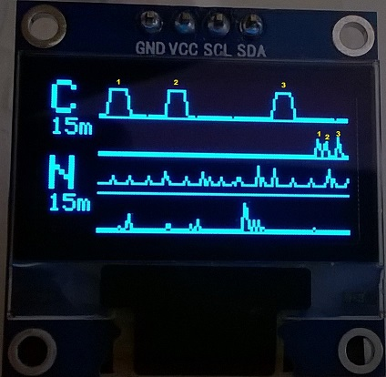
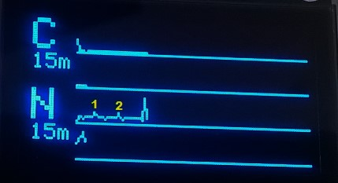

# ArduiPi_OLED Managed wrapper

## Prerequisites

```
apt-get install mono-complete nuget
```

## Build

```
sh ./mono/build.sh
```

## Run test

### Clock
```
sh ./mono/run_test.sh
```
	
### Graph cpu/net
```
sh ./mono/run_monitor.sh
```
- requires 96pt height display
- let you choose between one of available network interfaces
- graphs
	- cpu (each seconds)
	- cpu (last 15 min)
	- net tx+rx (each seconds)
	- net tx+rx (last 15 min)

#### Command line mode help
```
sh ./mono/run_monitor.sh -h
```

Example:
```
sh ./mono/run_monitor.sh -o 3 -d eth0 -q
```

#### Shots
- shows cpu each seconds and correspondent 15 min average sampling
	


- shows network autoresize behavior



